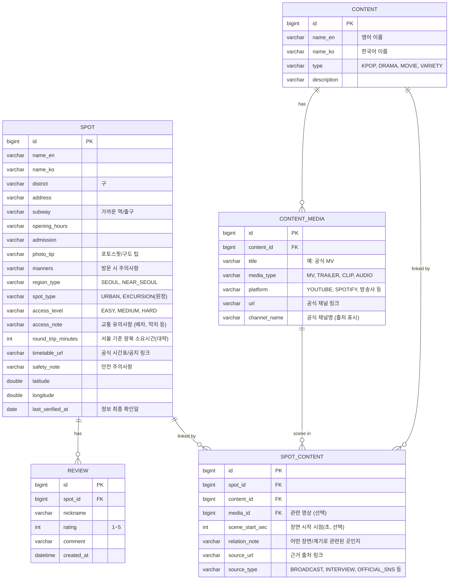
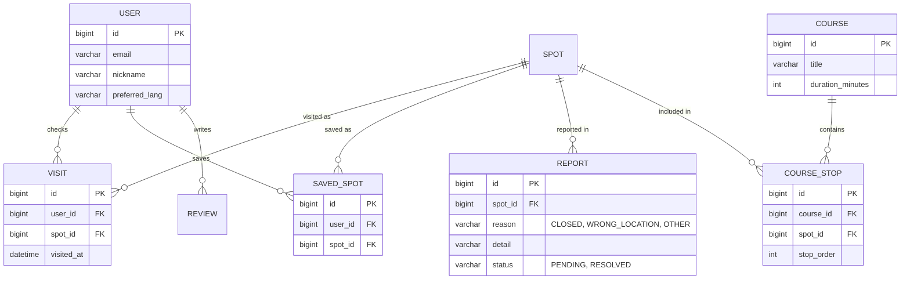

# K-콘텐츠 성지순례 앱 — 기획서 (PRD & ERD)

> 앱 이름(가칭): **K-Spot Trail** (이름은 팀원과 논의 후 변경 가능)
> 상태: 초안 v0.3 (원정 성지 컨셉 + 공식 영상 링크 기능 반영) / 작성일: 2026-10-02
> 한 줄 소개: 좋아하는 K-pop 아티스트와 드라마·영화의 촬영지를 서울과 근교에서 찾아, 때로는 기차를 타고 떠나는 여정까지 안내하는 외국인 팬을 위한 성지순례 앱
> 범위: **서울 + 서울 근교** (예: 경기도 양주 일영역)

---

## Part 1. PRD

### 1. 배경과 문제
- K-pop, 드라마, 영화를 계기로 한국을 찾는 외국인 팬이 많다.
- 팬들은 "그 장면의 장소", "그 아티스트가 다녀간 곳"을 직접 가 보고 싶어 하지만, 정보가 SNS·블로그·팬 커뮤니티에 흩어져 있고 대부분 한국어이거나 출처가 불분명하다.
- 일반 지도 앱에는 "어떤 작품과 관련된 장소인지"가 정리돼 있지 않다.
- 장소를 찾아도 가는 방법, 지금도 운영하는지, 방문 시 주의사항을 따로 확인해야 한다.

### 2. 목표 / 비목표

**목표 (MVP)**
- 작품/아티스트별로 관련 장소를 모아 보여준다.
- 지도에서 성지를 찾고, 가는 방법을 확인한다.
- 장소마다 "어떤 작품의 어떤 장면/계기인지"와 출처를 보여준다.
- 방문 체크(스탬프)와 방문 후기를 남긴다.

**비목표 (MVP에서 하지 않는 것)**
- 공식 굿즈 판매, 티켓 예매
- 아티스트·작품의 공식 이미지, 로고, 영상 사용
- 연예인 개인 거주지 등 사생활 관련 장소 제공
- 실시간 길찾기 (외부 지도 앱으로 연결)
- 로그인/회원가입 (1차 버전)

### 3. 타깃 사용자
| 구분 | 설명 |
|---|---|
| 주 사용자 | K-pop·K-드라마 팬인 외국인 방문객 (10대 후반~30대) |
| 사용 상황 | 여행 전 일정 계획, 여행 중 현장에서 위치 확인 |
| 사용 언어 | 영어 우선 (한국어 지명 병기) |

**대표 사용자 예시**: "BTS 팬인 미국인 대학생 에밀리. 서울 3박 4일 일정으로, 좋아하는 아티스트와 관련된 장소를 최대한 많이 돌아보고 싶다."

### 4. 차별점
1. **작품/아티스트 중심 탐색**: 일반 관광 앱은 장소 중심이지만, 이 앱은 "내 최애" 중심으로 장소를 찾는다.
2. **출처가 있는 정보**: 모든 성지에 근거(방송, 공식 인터뷰, 공식 SNS 등)를 표시해서 정보 신뢰도를 높인다.
3. **스탬프 투어**: 방문을 체크하며 성지를 모으는 재미를 준다.
4. **팬을 위한 실용 정보**: 포토스팟 구도, 방문 매너, 혼잡 시간대 같은 팁을 제공한다.
5. **"원정 성지"와 기차 여행의 낭만**: 교통이 불편한 근교 성지도 일부러 담는다. 불편함을 단점으로 숨기지 않고, "기차 시간에 맞춰 떠나 그 장면 속에 서 보는" 여정 자체를 경험으로 제안한다. 대신 시간표, 막차, 안전 수칙 같은 준비 정보를 확실히 제공한다.

**장소 유형**
| 구분 | 예시 | 특징 |
|---|---|---|
| 도심 성지 | 서울 안의 거리, 건물 | 지하철로 쉽게 접근 |
| 원정 성지 | 서울 근교 간이역 등 | 교통이 불편해 계획이 필요하고, 여정 자체가 콘텐츠 |

### 5. 핵심 사용자 시나리오
1. 앱을 열고 좋아하는 아티스트나 작품을 선택한다.
2. 관련 성지 목록과 지도를 본다.
3. 가고 싶은 장소를 저장하고, 가까운 성지끼리 묶어서 동선을 확인한다.
4. 현장에서 장소 상세를 보고(어떤 장면인지, 포토스팟, 주의사항), 외부 지도 앱으로 길을 찾는다.
5. 도착하면 방문 체크를 하고 후기를 남긴다.

### 6. 기능 요구사항

| ID | 기능 | 우선순위 | 설명 |
|---|---|---|---|
| F-01 | 작품/아티스트 목록 | P0 | 종류별(K-pop, 드라마, 영화, 예능) 탐색, 검색 |
| F-02 | 성지 목록 | P0 | 선택한 작품/아티스트의 관련 장소 카드 목록 |
| F-03 | 성지 상세 | P0 | 장소 정보, 관련 장면 설명, 출처, 포토스팟 팁, 주소·교통 |
| F-04 | 지도 보기 | P0 | 성지 마커 표시, 작품 필터 적용 |
| F-05 | 외부 지도 연결 | P0 | 구글 지도/네이버 지도 앱으로 길찾기 열기 |
| F-06 | 방문 체크(스탬프) | P1 | 방문한 곳 표시, 진행률(예: 7/20) 보기 |
| F-07 | 저장(위시리스트) | P1 | 가고 싶은 성지 저장 (기기 로컬) |
| F-08 | 후기/사진 후기 | P1 | 닉네임 + 별점 + 코멘트 |
| F-09 | 내 주변 성지 | P2 | 위치 권한 허용 시 가까운 순 정렬 |
| F-10 | 방문 매너 안내 | P1 | 실제 운영 중인 상업 시설·주거지 근처 주의사항 |
| F-11 | 정보 오류 신고 | P2 | "폐업했어요", "장소가 달라요" 제보 |
| F-12 | 코스 추천 | P3 | 지역별 반나절 성지 코스 |
| F-13 | 다국어 | P3 | 일본어, 중국어, 스페인어 등 |
| F-14 | 오프라인 캐시 | P2 | 데이터 없이도 저장한 성지 열람 |
| F-15 | 교통 난이도·시간표 안내 | P0 | 접근성(쉬움/보통/어려움), 왕복 소요시간, 열차 시간표·막차 안내(공식 링크 연결, "방문 전 확인" 문구) |
| F-16 | 원정 성지 준비물·안전 안내 | P0 | 무인역 등 편의시설 부족, 선로 출입 금지, 막차 주의, 챙길 것 안내 |
| F-17 | 원정 코스 | P2 | "대곡역 → 일영역"처럼 가는 과정을 하나의 기차 여행 코스로 안내, 기다리는 시간에 할 것 추천 |
| F-18 | 원정 스탬프 | P2 | 원정 성지 전용 특별 스탬프/배지 |
| F-19 | 공식 영상·음악 링크 | P1 | 작품/성지 상세에서 관련 MV, 예고편, 공식 클립으로 연결. 앱이 영상을 직접 저장·재생하지 않고 공식 채널 링크로 연다. |
| F-20 | 장면 시점 안내 | P2 | "MV 0:10 부근"처럼 해당 성지가 나오는 시점을 표시하고, 가능하면 그 시점으로 바로 열리는 링크 제공 |

우선순위: P0 = 없으면 출시 불가 / P1 = 있으면 좋음 / P2, P3 = 이후 확장

### 7. 화면 구성 (MVP)

```
[Home]
  ├─ 인기 작품/아티스트 ──▶ [작품/아티스트 상세 (성지 목록)] ──▶ [성지 상세]
  ├─ 검색
  └─ 탭: Explore / Map / My Trail(저장·스탬프)

[Map] ── 마커 ──▶ [성지 상세] ──▶ 외부 지도 열기 / 방문 체크 / 후기 작성
[My Trail] ── 저장한 곳, 방문한 곳, 진행률
```

### 8. 운영 원칙 (중요)

이 앱은 다른 사람의 저작물·이름·사생활과 가까이 있어서 아래 원칙을 지켜야 한다.

| 항목 | 원칙 |
|---|---|
| 이미지 | 공식 사진, 앨범 커버, 스틸컷, 로고를 쓰지 않는다. 직접 촬영하거나 이용 허락이 확인된 것만 사용한다. |
| 이름 사용 | 아티스트·작품명은 "정보 제공" 목적으로 텍스트로만 쓰고, 공식 앱인 것처럼 보이지 않게 한다. 앱 이름에는 아티스트명이나 소속사명을 넣지 않는다. |
| 사생활 | 연예인 거주지, 가족 사업장, 비공개 시설은 등록하지 않는다. 공개된 관광지·상업 시설만 다룬다. |
| 정보 출처 | 촬영지·방문지는 방송, 공식 인터뷰, 공식 SNS 등 근거가 있는 것만 등록하고 출처를 표시한다. |
| 매너 | 장소 상세에 "주민/영업장에 방해되지 않게 조용히 방문" 같은 안내를 넣는다. |
| 영상·음악 링크 | 공식 채널(소속사·방송사·플랫폼 공식 계정)에 올라온 영상만 링크한다. 영상 파일을 앱에 저장하거나 내려받게 하지 않고, 비공식 업로드·재업로드 링크는 쓰지 않는다. 앱 안에 재생기를 넣더라도 해당 플랫폼이 허용하는 공식 임베드 방식만 사용한다. |
| 안전 | 선로·철도 시설 무단 출입 금지를 상세 화면에 명시하고, 위험한 촬영 구도는 추천하지 않는다. 무인역·외진 곳은 막차 시간과 대체 교통 수단을 함께 안내한다. |
| 교통 정보 | 시간표·운행 정보는 바뀔 수 있으므로 앱에 고정값으로 적지 않고 공식 링크와 "방문 전 확인" 문구를 함께 제공한다. |
| 면책 | "비공식 팬 가이드이며 해당 아티스트·작품·소속사와 관련 없음" 문구를 표시한다. |

> 위 원칙은 법률 검토가 아니라 일반적인 주의 사항이다. 실제 출시 전에는 상표·저작권·개인정보 관련 확인이 필요하다.

### 9. 비기능 요구사항
- 첫 화면 로딩 3초 이내 (일반 LTE 기준)
- 네트워크가 불안정해도 앱이 죽지 않고 오류를 안내한다
- iOS / Android 지원
- 위치 정보는 사용자 동의 시에만 사용하고 서버에 저장하지 않는다
- 리뷰 입력값 검증 (닉네임 필수, 별점 1~5, 코멘트 1000자 이하)

### 10. 기술 스택 (안)
| 영역 | 선택 | 비고 |
|---|---|---|
| 모바일 | React Native (Expo) | 대안: Flutter |
| 백엔드 | Spring Boot 3 + Spring Data JPA (Java 21) | REST API |
| DB | 개발: H2 / 운영: MySQL (AWS RDS) | |
| 배포 | AWS EC2 + RDS, Docker | |
| 지도 | react-native-maps | 길찾기는 외부 앱 연결 |
| 로컬 저장 | AsyncStorage | 저장·스탬프 (로그인 없는 1차 버전) |

### 11. 개발 단계
| 단계 | 내용 | 완료 기준 |
|---|---|---|
| 1단계 | 앱만 (더미 데이터 내장) | 작품 선택 → 성지 목록/상세/지도가 폰에서 동작 |
| 2단계 | 백엔드 연동 | 앱이 API로 데이터를 받고 후기 저장 |
| 3단계 | AWS 배포 | 공개 주소의 API로 앱 동작 |
| 4단계 | 확장 | 코스 추천, 다국어, 오류 신고, 로그인 |

### 12. 성공 지표
- 주변 사람 5명 이상이 실제로 사용해 본다
- 핵심 흐름(작품 선택 → 성지 상세 → 방문 체크)이 막힘 없이 동작한다
- 등록된 모든 성지에 출처가 기록돼 있다
- AWS에서 24시간 이상 안정적으로 동작한다

### 13. 리스크 / 열린 질문

| 항목 | 내용 | 대응 |
|---|---|---|
| 데이터 확보·검증 | 성지 정보를 직접 조사하고 근거를 확인해야 해서 가장 손이 많이 간다 | MVP는 한 아티스트/작품군 중심 20곳 내외로 시작, 팀원이 분담 |
| 정보 정확성 | 촬영지 폐업·이전, 잘못 알려진 정보 | 출처 표시, 최종 확인 날짜 기록, 오류 신고 기능 |
| 저작권·상표 | 이름·이미지 사용 문제 | 8번 운영 원칙 준수, 출시 전 점검 |
| 사생활 침해 | 방문객 몰림으로 인한 민원 | 사적 장소 제외, 방문 매너 안내 |
| 범위 확대 | 아티스트가 너무 많아 끝이 없음 | 1차는 1~2개 그룹/작품군으로 한정 |
| 원정 성지 변동성 | 역사 리모델링·철거, 열차 운행 변경 등으로 현장이 달라질 수 있음 (실제로 일영역은 2024년 11월 복원 공사가 시작됨) | `last_verified_at`, 오류 신고, 출처 표시, 원정 성지는 최근 방문 후기로 재확인 |
| 원정 안전 | 무인역·외진 곳에서 막차를 놓치거나 위험한 촬영을 할 수 있음 | F-15, F-16을 P0로 두고 안전 원칙 준수 |
| 팬덤 편중 | 특정 팬덤 중심이면 사용자층이 좁음 | 작품 구조를 일반화해서 이후 확장 가능하게 설계 |

**팀과 논의할 질문**
1. 1차 버전의 중심 아티스트/작품은 무엇으로 할까?
2. 데이터 조사는 누가, 어떤 기준으로 할까?
3. 스토어 출시까지 갈지, 포트폴리오용으로 할지?
4. 로그인 없이 시작해도 되는가?
5. 범위를 "서울 + 근교"로 넓히고 원정 성지를 핵심 컨셉으로 가져갈까?
6. 앱 이름에서 "서울"을 빼도 괜찮은가?
7. 영상은 링크로 열기만 할까, 앱 안에서 공식 임베드로 재생할까?

---

## Part 2. ERD

### 1. MVP ERD



**관계 설명**
- **작품/아티스트(CONTENT) N : 성지(SPOT) N** → 연결 테이블 `SPOT_CONTENT`로 풀어 쓴다.
  - 한 작품에 성지가 여러 곳이고, 한 장소가 여러 작품과 관련될 수 있기 때문이다.
- **성지(SPOT) 1 : 후기(REVIEW) N**
- 연결 정보(`relation_note`, `source_url`)는 "장소"가 아니라 "장소와 작품의 관계"에 속하는 정보라서 연결 테이블에 둔다.

**설계 메모**
- `last_verified_at`으로 정보가 얼마나 최신인지 보여줄 수 있다.
- 방문 체크(스탬프)와 저장은 1차 버전에서 기기 로컬에 저장하므로 테이블이 없다.
- 지난번 관광 앱의 `Attraction`, `Review` 구조를 `Spot`, `Review`로 이어 쓸 수 있다.

### 2. 확장 ERD (4단계 이후)



### 3. API 설계 (MVP)

| 메서드 | 경로 | 설명 |
|---|---|---|
| GET | `/api/contents?type=&q=` | 작품/아티스트 목록 (종류·검색 필터) |
| GET | `/api/contents/{id}` | 작품/아티스트 상세 |
| GET | `/api/contents/{id}/spots` | 해당 작품의 성지 목록 |
| GET | `/api/contents/{id}/media` | 작품의 공식 영상·음악 링크 목록 |
| GET | `/api/spots?q=` | 성지 전체/검색 (지도용) |
| GET | `/api/spots/{id}` | 성지 상세 (관련 작품, 출처, 평균 별점 포함) |
| GET | `/api/spots/{id}/reviews` | 후기 목록 |
| POST | `/api/spots/{id}/reviews` | 후기 작성 |

---

## 부록. 초기 데이터 준비 방법

**성지 하나를 등록할 때 체크리스트**
- [ ] 공개된 장소인가? (개인 거주지·비공개 시설이 아닌가)
- [ ] 작품/아티스트와의 관련성을 뒷받침하는 출처가 있는가?
- [ ] 현재 운영 중인가? (폐업·이전 여부 확인)
- [ ] 주소, 좌표, 가까운 지하철역을 확인했는가?
- [ ] 이미지는 직접 촬영했거나 사용 허락이 있는가?
- [ ] 방문 시 주의사항을 적었는가?

**초기 후보 장소 유형 (구체적인 장소는 팀이 조사 후 확정)**
- 드라마·영화 촬영지로 알려진 공개 장소 (거리, 계단, 공원, 한옥마을 등)
- 공식적으로 일반에 열려 있는 아티스트/소속사 관련 전시·체험 공간
- 팬들이 많이 찾는 공식 팝업, 전시 장소 (기간 한정이면 운영 기간 표시)

> 그 외 장소는 출처 확인 없이 적으면 틀린 정보가 될 수 있으므로, 팀원들이 방송·공식 채널 기준으로 조사한 뒤 위 체크리스트로 검증해서 채운다.

### 샘플 데이터: 일영역 (원정 성지 예시)

조사일 2026-10-02 기준. 아래 출처에서 확인한 내용이며, **방문 전 최신 상태 재확인이 필요하다.**

| 항목 | 내용 | 확인 상태 |
|---|---|---|
| 이름 | Ilyeong Station (일영역) | 확인됨 |
| 위치 | 경기도 양주시 장흥면 일영로647번길 25 (서울 근교) | 확인됨 |
| 유형 | EXCURSION(원정), 접근성 HARD | 기획 판단 |
| 관련 작품 | BTS '봄날' MV (도입부 촬영지) | 여러 기사에서 확인됨 |
| 관련 영상 | '봄날' 공식 MV의 도입부 장면 (공식 채널 링크와 장면 시점은 직접 확인 후 입력) | **링크·시점 미입력, 확인 필요** |
| 관련 작품(추가) | 영화 '엽기적인 그녀' | **단일 출처(위키트리)만 확인, 검증 필요** |
| 교통 | 교외선(대곡~의정부) 여객 운행 2025-01-11 재개, 하루 왕복 8회, 일영역 정차 | 확인됨, 시간표는 코레일에서 재확인 |
| 역 건물 상태 | 2024-11 복원 공사(리모델링) 시작, 대합실 철거. 박물관·간식 판매 등 2025년 상반기 단계적 개방 예정이라고 보도됨 | **현재(2026-10) 모습 미확인, 방문 전 재확인 필요** |
| 안전 | 선로 무단출입 금지(철도안전법), 무인 간이역이라 내부 시설 이용 제한 | 보도 기준 |

**출처**
- [위키백과 - 일영역](https://ko.wikipedia.org/wiki/%EC%9D%BC%EC%98%81%EC%97%AD)
- [KB Think - 교외선 재개통 정리](https://kbthink.com/main/real-estate/basic-information/first-time-real-estate/2025/first-time-real-estate-250224.html)
- [위키트리 - 서울 근교 아미 투어](https://www.wikitree.co.kr/articles/1126605)
- [Koreaboo - 일영역 철거 보도](https://www.koreaboo.com/news/bts-spring-day-station-demolished-iryeong-station/)

> 이 샘플은 "교통이 불편해도 일부러 가는 원정 성지"라는 컨셉을 보여주는 예시이다.
